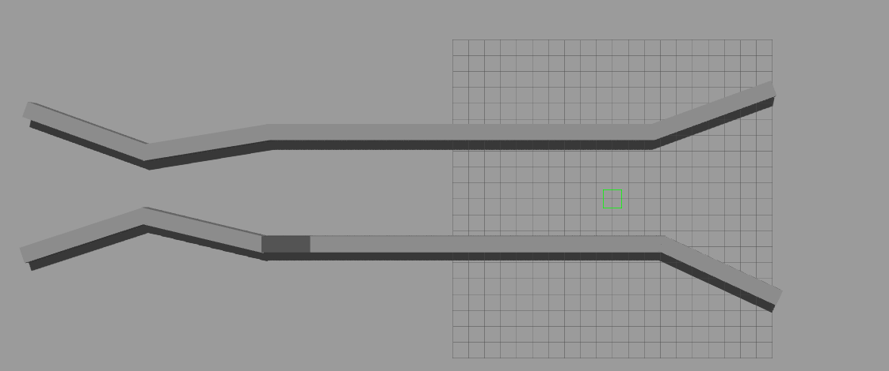
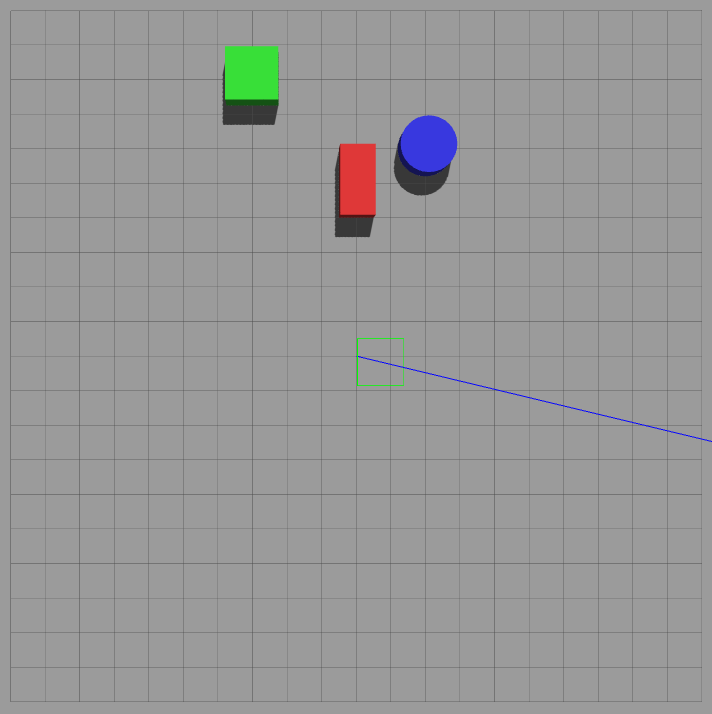

This repo consists of all the baselines for coordination MRN and formation adaptation 

It contains different kinds of Gazebo worlds 

#World 1 

#World 2

#World 3

A description about the different Scenarios that the baselines are tested upon are 

1. Scenario 1: Simple static obstacles (boxes, cylinders) - good for basic testing
2. Scenario 2: Dynamic obstacles that move - tests collision avoidance with moving objects
3. Scenario 3: Dense static obstacles at high speeds - tests quick decision making and formation adaptation
4. Scenario 4: Dynamic obstacles with faster robots - most challenging for realtime deployment and high speed navigation
5. Scenario 5: Constrained passage with high speed - tests formation navigation through narrow spaces and adaptability. 
6. Scenario 6: Constrained environment with low/normal speeds - tests formation coordination in narrow corridors. 
