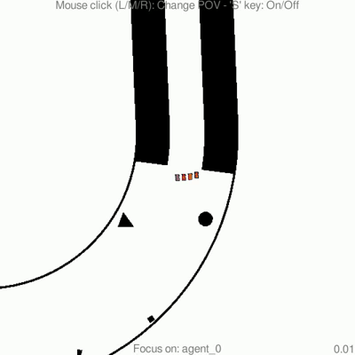
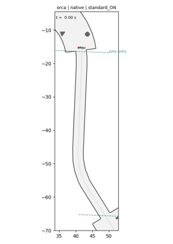
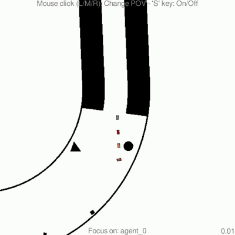
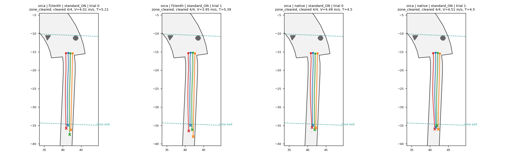
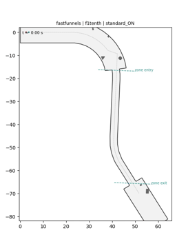
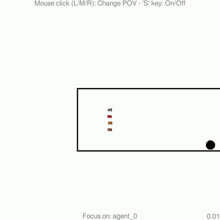

# Baselines for Coordinated Multi-Robot Navigation in Narrow Spaces

Six multi-robot navigation baselines, one command line, one map, one scoring
rule. Every baseline runs on the simulator it was published with **and** on
the f1tenth_gym car plant, so the numbers land in the same table as the
FastFunnels results.

```bash
python run_experiment.py --orca   --num_agents=4 --map=standard_ON                 # f1tenth plant
python run_experiment.py --orca   --num_agents=4 --map=standard_ON --sim=native    # RVO2 discs
python run_experiment.py --nmpc   --num_agents=4 --map=standard_ON --dynamics=ks   # kinematic plant
python run_experiment.py --deform --num_agents=4 --map=standard_ON --sim=native    # Gazebo + TurtleBot3
python run_experiment.py --list
```

<p align="center">
  
  
  
  
</p>
<p align="center"><sub>Four agents through the <b>whole 51 m narrow section</b> of <code>standard_ON</code>, funnel mouth to exit: ORCA (f1tenth plant), ORCA (native RVO2), decentralised NMPC, leader-follower (which rear-ends itself mid-corridor). Full-resolution MP4s are next to the GIFs in <code>ffbench_results/</code>; <code>--zone section</code> reproduces them.</sub></p>

## The task

N cars line up 7 m before a 3.2 m wide pinch in the `open_narrow_obs`
corridor (`standard_ON`) and have to get through it. Only the 24 m window
around the pinch is scored:

| column | meaning |
|---|---|
| `V_bar` | mean speed inside the zone (m/s) |
| `eSR` | episode success: every agent cleared the zone, no collision |
| `T_zone` | first agent in to last agent out (s) |
| `flow` | agents cleared / (gap width × T_zone) |
| `deform` | lateral spread at entry / tightest spread inside (≥ 2 agents) |
| `aSR` | fraction of agents that cleared |

## Results this repo reproduces

Verified 2026-09-08, three independent runs each (5 jittered trials per run, 4
agents, 5 m/s target, single-track plant; DEFORM: 3 bridge + 3 native container trials). `ffbench_results/verify_all.csv`
and `verify_repeats.csv` hold the rows; `ffbench_results/verify_*_traces.png`
the trajectories.

| baseline | native simulator | on f1tenth | eSR (native / f1tenth) | V_bar | T_zone | beyond the pinch window |
|---|---|---|---|---|---|---|
| ORCA | RVO2 discs | yes | 1.0 / 1.0 | 4.5 / 4.0 | 4.5 / 5.2 | whole section: 1/3 trials, 17.8 s |
| Leader-follower | f1tenth_gym | yes | – / 1.0 | 3.3 | 7.9 |
| NMPC (decentralised, no leader) | f1tenth_gym | yes | – / 1.0 | 4.3 | 4.9 | whole 51 m section: 3/3, 11.0 s |
| GCBF+ (pretrained) | PyRoboSim + JAX | cross-over | 3 of 4 agents / 2 of 4 agents | 0.7 / 0.6 | – |
| LAS (CBF-PPO, 3 agents) | its own f1tenth gym | same | 0.2 | 0.74 | 14.3 |
| **FastFunnels** (ours: patch + NMPC follower) | f1tenth_gym | native | 1.0 (N=1, full course) | 7.1 | 7.3 |
| DEFORM | Gazebo + TurtleBot3 | via ROS bridge | 0.0 / 0.0 | 0.03 / 0.09 | – | creeps at cm/s in the corridor; container run |

<!-- <p align="center">
  
</p> -->

### Start line to finish line

`--course full` runs the whole 120 m track: the 9 m wide approach, the bend,
the 51 m narrow section and the end box. At 4 agents no baseline finishes:
ORCA gets 2-3 cars through and loses one at the funnel-mouth disc, the
patch-free NMPC clears the narrow section in 11-13 s when it does not spin at
the start, the convoy rear-ends itself in the bend, DEFORM's planner cannot
handle a 120 m goal. FastFunnels with one follower is the only run that
completes the course: 20.4 s start to finish, 7.1 m/s through the narrow
section (`ffbench_results/full_all.csv`). With 2 or 4 followers the inside-slot
follower clips the wall-hugging triangle at the funnel mouth.

<p align="center">
  
  
</p>

```bash
python run_experiment.py --fastfunnels --num_agents 1 --map standard_ON --course full --record   # needs FASTFUNNELS_ROOT
python run_experiment.py --nmpc --num_agents 4 --map standard_ON --course full --spawn_jitter 0.1 --record
```

## Install

```bash
git clone --recurse-submodules <this repo> && cd baselines_formations   # DEFORM is a submodule
bash ffbench/env/setup.sh            # conda env "ffbench", builds Python-RVO2, runs a smoke test
conda activate ffbench
export QT_QPA_PLATFORM=offscreen     # headless machines
```

Optional environments, each one command: `setup.sh --gcbf` (JAX, for GCBF+;
then `export FFBENCH_PY_GCBF=...`), `setup.sh --las` (the LAS authors' forks;
then `export FFBENCH_PY_FASTFUNNELS=...`). DEFORM runs in a ROS Noetic
container built from the pinned `DEFORM/` submodule, from the repo root:

```bash
docker build -t deform_ros:latest -f baselines/deform_docker/Dockerfile .                       # Docker
apptainer build --fakeroot --ignore-fakeroot-command ffbench_generated/deform_ros.sif ffbench/ros/deform_ros.def   # no root needed
```

`run_experiment.py --deform` picks whichever exists. Exact steps and the
container smoke test in [`ffbench/README.md`](ffbench/README.md).

## Use the results

Every run writes three things next to each other:

```
ffbench_results/<baseline>_<map>_n<N>_<sim>.jsonl   one row per trial, every metric
ffbench_results/<baseline>_<map>_n<N>_<sim>.csv     mean per condition
(printed table)
```

Add `--save_traces` for positions, `--record` for an MP4 per condition, then:

```bash
python -m ffbench.eval.plot_traces   ffbench_results/<stem>          # trajectories over the corridor
python -m ffbench.eval.animate_traces ffbench_results/<stem> --key "native|standard_ON|0"
python -m ffbench.eval.collect "ffbench_results/*.jsonl" --out table  # merge runs into one table
```

Regenerate the figures and videos above:

```bash
for b in orca leader_follower nmpc; do
  python run_experiment.py --$b --num_agents 4 --map standard_ON --sim both --trials 5 \
      --spawn_jitter 0.1 --save_traces --record --out ffbench_results/verify_${b}_n4
  python -m ffbench.eval.plot_traces ffbench_results/verify_${b}_n4 --trials 2
done
```

## Layout

```
run_experiment.py        the CLI
ffbench/                 map generator (f1tenth / RVO2 / Gazebo+ROS / GCBF+ targets), f1tenth plant +
                         command translators, protocol, metrics, one adapter per baseline, env files
baselines/               the baseline code: orca.py, leader_follower.py, gcbf_baseline/, las_sweep.py,
                         deform_docker/ (ROS bridge + Dockerfile), vendored Python-RVO2, gcbfplus,
                         learning_adaptive_safety (with the local map overrides), maps/ (the shared maps)
f1tenth_gym/             the vehicle simulator (install with pip install --no-deps -e ./f1tenth_gym)
ffbench_generated/       derived map bundles (RVO2 polygons, Gazebo worlds, DEFORM configs); regenerable
ffbench_results/         the verified rows, plots and videos shown above
DEFORM/                  git submodule: the DEFORM planner the container is built from (patched at build time)
legacy_native/           the earlier hand-built Gazebo and PyRoboSim scenes, kept for reference, not used by the benchmark
```

## Notes

- Seeds only matter with `--spawn_jitter`; a deterministic baseline repeats exactly otherwise.
- The 100 randomised layouts (`--map eval_matched`, `eval_heldout`) are not in this repo (1 GB); copy them from FastFunnels into `maps/`.
- LAS runs on its own copy of `open_narrow_obs` whose pinch sits elsewhere, and its NPC speed setting has no effect; both are inherited from the released checkpoint.
- Older demo videos of the hand-built scenes: [Google Drive](https://drive.google.com/drive/folders/1KrD17Asrr-kUL6zi8UAPdhaNJMniDBb9?usp=sharing).
